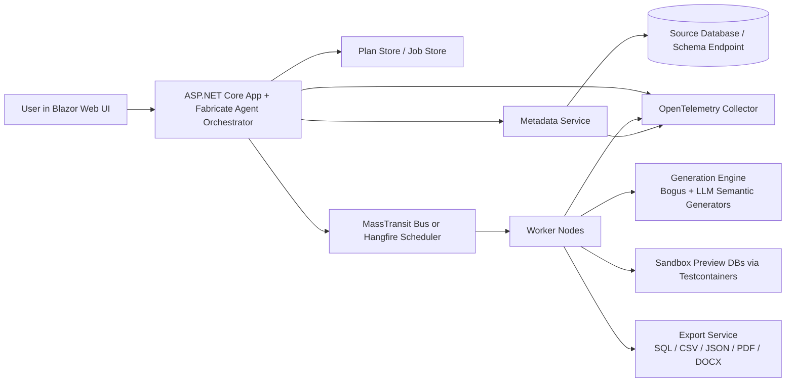

# concoction

Concoction is a proposed open-source, agentic synthetic data platform for the .NET ecosystem: a modern C# (.NET 10) equivalent of Tonic Fabricate.

## Goals

Concoction should help teams safely create realistic test data by combining:

- schema understanding from live databases or natural-language prompts
- agentic planning for multi-step generation workflows
- deterministic relational seeding with referential integrity
- hybrid structured and unstructured synthetic data generation
- distributed execution for large jobs
- observability for auditability and debugging

## High-Level Architecture

### System Diagram Description



### Component Responsibilities

- **Blazor Web UI**: Chat-style experience for prompts like `Generate a retail DB with 10k orders`, plan review, job monitoring, previews, and exports.
- **ASP.NET Core App / Fabricate Agent Orchestrator**: Hosts the primary agent, exposes APIs, coordinates planning, approval, execution, and replay.
- **Metadata Service**: Connects to PostgreSQL, MySQL, SQL Server, and other providers to inspect schemas, profile safe aggregate statistics, and build a foreign-key dependency graph.
- **Plan Store / Job Store**: Persists generation plans, run state, prompts, model decisions, lineage metadata, and export manifests.
- **MassTransit or Hangfire**: Dispatches long-running generation work, partitioned by table groups, document batches, or export phases.
- **Worker Nodes**: Execute the approved plan, generate data in dependency order, write to sandbox databases, and produce exports.
- **Generation Engine**: Mixes deterministic rule-based generation with LLM-powered semantic synthesis for selected fields.
- **Export Service**: Produces SQL seed scripts, database snapshots, CSV/JSON bundles, and unstructured artifacts such as PDF or DOCX.
- **OpenTelemetry**: Captures traces, metrics, and logs for agent decisions, profiling steps, generation throughput, failures, and data quality checks.

## Agentic Orchestration

The core of Concoction is a **Fabricate Agent** built with **Microsoft Agent Framework** (preferred) or **Semantic Kernel** when a lighter abstraction is sufficient.

### Recommended Agent Pattern

1. **Conversation Intake**
   - Accept user intent, constraints, provider selection, scale, and output format.
   - Example: `Generate a retail database with 10k orders, preserve order-status distribution, and include PDF invoices.`
2. **Tool-Assisted Discovery**
   - Call tools for schema introspection, safe aggregate profiling, provider capability detection, and existing template lookup.
3. **Plan Drafting**
   - Produce a structured `GenerationPlan` with:
     - entities to synthesize
     - row counts per entity
     - insertion order
     - generator strategy per field
     - document generation steps
     - validation and export steps
4. **Human Review / Auto-Approval**
   - Allow the user to edit or approve the plan before execution.
5. **Execution Delegation**
   - Submit discrete jobs to the background execution system.
6. **Progress and Repair Loop**
   - Feed worker results back into the agent so it can retry, re-plan, or explain failures.

### Tooling Model

The agent should call explicit tools rather than embedding all logic in prompts:

- `InspectSchemaTool`
- `ProfileDistributionTool`
- `BuildDependencyGraphTool`
- `GenerateStructuredDataTool`
- `GenerateDocumentArtifactTool`
- `ValidateReferentialIntegrityTool`
- `ExportDatasetTool`

This keeps the agent auditable, testable, and compatible with OpenTelemetry spans per tool invocation.

## Schema Discovery & Metadata Engine

### EF Core / Dapper Strategy

Use both, each where it fits best:

- **EF Core Design + provider metadata** for reverse engineering, relationship discovery, and provider abstractions.
- **Dapper** for fast, read-only access to `information_schema`, `sys.*`, and provider-specific catalog queries during live profiling.

### Metadata Pipeline

1. Open a provider-specific connection.
2. Read tables, columns, PKs, FKs, indexes, nullability, defaults, enums, and computed columns.
3. Build a normalized in-memory model:
   - `DatabaseModel`
   - `EntityModel`
   - `ColumnModel`
   - `ForeignKeyEdge`
4. Convert foreign keys into a directed acyclic graph when possible.
5. Tag problematic structures:
   - self-references
   - cycles
   - optional back-references
   - bridge tables
   - provider-specific identity/sequence semantics

### Suggested Core Types

```csharp
public sealed record GenerationPlan(
    string Provider,
    IReadOnlyList<EntityPlan> Entities,
    IReadOnlyList<GenerationStep> Steps,
    ExportPlan Export);

public sealed record EntityPlan(
    string Name,
    long TargetRowCount,
    IReadOnlyList<FieldStrategy> Fields,
    IReadOnlyList<string> DependsOn);
```

## Generative Engine

Concoction should use a **hybrid generation model**.

### Rule-Based Generation

Use **Bogus** for:

- names, addresses, commerce data, dates, money, identifiers
- deterministic seeding and reproducibility
- provider-safe fake values for constrained fields
- bulk generation of high-volume structured rows

### Semantic Generation

Use LLM-backed generation only for fields that benefit from semantics, for example:

- medical notes
- support tickets
- product descriptions
- contract clauses
- invoice summaries

### Guardrails for Semantic Fields

- generate from schema-aware prompts, not raw production rows
- use policy filters to block PII, secrets, and unsafe outputs
- constrain outputs with JSON schema or typed object responses
- cache prompts/results for repeatability where needed
- validate length, format, and allowed vocabulary before persistence

### Recommended Blend

- **80-95% rule-based** for most relational fields
- **5-20% semantic** for narrative or domain-rich text columns

That ratio keeps cost, latency, and drift under control while still making datasets realistic.

## Relational Integrity Layer

### Topological Sort for Insert Order

The metadata engine should convert FK relationships into a graph and compute insertion batches using topological sort:

1. Nodes represent tables.
2. Directed edges represent `parent -> child` dependencies.
3. Apply Kahn's algorithm to find a valid insertion order.
4. Group independent nodes into parallelizable batches.

### Handling Cycles and Self-References

Real schemas are not always acyclic. Recommended solutions:

- **Deferred constraints** when the provider supports them.
- **Two-phase insert/update**:
  1. insert rows with nullable FK placeholders
  2. backfill cyclic references in an update phase
- **Synthetic key reservation** to pre-allocate identifiers for mutually dependent records.
- **Edge breaking rules** for optional relationships where a temporary null is acceptable.

### Cross-Provider Support

Abstract provider differences behind a `IRelationalDialect` contract:

- identity/sequence behavior
- bulk insert syntax
- deferred constraint support
- temporary table support
- pagination/streaming semantics

Target initial providers:

- PostgreSQL
- MySQL
- SQL Server

## Distributed Task Processing

### Preferred Default: MassTransit

Use **MassTransit** when the platform must scale horizontally and execute large plans across many workers.

Recommended queues/topics:

- `plan-created`
- `profile-schema`
- `generate-entity-batch`
- `generate-documents`
- `validate-dataset`
- `export-artifacts`

### When Hangfire Fits

Use **Hangfire** for simpler deployments where a durable scheduler and dashboard matter more than full event-driven orchestration.

### Worker Execution Model

Each worker should:

1. fetch its assigned step
2. open a sandbox target (often via Testcontainers)
3. generate a chunk of rows/documents
4. persist progress and quality metrics
5. emit telemetry
6. publish the next step or compensation event

## Observability & Telemetry

Integrate **OpenTelemetry** end-to-end.

### Required Signals

- **Traces**
  - user prompt -> plan creation -> schema inspection -> worker execution -> export
- **Metrics**
  - rows generated/sec
  - queue depth
  - failed steps
  - retry counts
  - semantic generation latency/cost
  - referential integrity violations
- **Logs**
  - agent decisions
  - tool inputs/outputs (sanitized)
  - validation failures
  - provider-specific SQL/export errors

### Recommended Correlation Model

Assign a single `FabricationRunId` and propagate it through:

- HTTP requests
- agent sessions
- background messages
- worker spans
- export artifacts

This makes debugging and audit trails practical.

## Data Flow

For a prompt like **"Generate a retail DB with 10k orders"**, the end-to-end flow should be:

1. **Prompt Intake**
   - User submits the request in the Blazor UI.
2. **Intent + Constraint Parsing**
   - The Fabricate Agent extracts domain, scale, provider, output type, and realism constraints.
3. **Schema Discovery**
   - Metadata Service introspects the target schema or template.
4. **Safe Profiling**
   - Only aggregate distributions, null rates, category frequencies, and range statistics are collected from production-connected sources.
5. **Plan Generation**
   - The agent drafts a `GenerationPlan` covering tables such as `customers`, `orders`, `order_items`, `products`, and `invoices`.
6. **Dependency Resolution**
   - The relational integrity layer topologically sorts inserts and isolates cyclic updates.
7. **Job Dispatch**
   - The plan is partitioned into worker tasks and queued through MassTransit or scheduled with Hangfire.
8. **Structured Data Synthesis**
   - Workers use Bogus and distribution-aware samplers to generate relational rows.
9. **Unstructured Artifact Synthesis**
   - Optional document workers produce invoice PDFs, support emails, or DOCX attachments.
10. **Validation**
   - The dataset is checked for FK integrity, uniqueness, value ranges, and distribution alignment.
11. **Export**
   - Results are packaged as SQL scripts, database dumps, CSV/JSON, or file bundles.
12. **Delivery**
   - The UI streams progress and provides downloadable artifacts plus a run report.

## Recommended Tech Stack

### Application & UI

- **.NET 10 / ASP.NET Core**
- **Blazor Web App** with interactive server or auto render mode
- **Minimal APIs** for job and metadata endpoints
- **SignalR** for live progress streaming

### AI & Agentic Orchestration

- **Microsoft Agent Framework** for tool-calling, multi-agent workflows, and conversation state
- **Semantic Kernel** for lighter-weight prompt orchestration and planner support
- **Microsoft.Extensions.AI** for model abstraction
- Provider adapters for Azure OpenAI, OpenAI, or local OSS models

### Data Access & Schema Discovery

- **Entity Framework Core**
- **Microsoft.EntityFrameworkCore.Design**
- **Dapper**
- Provider packages:
  - `Npgsql`
  - `MySqlConnector`
  - `Microsoft.Data.SqlClient`

### Synthetic Data & Files

- **Bogus**
- **CsvHelper** for tabular exports
- **QuestPDF** for PDFs
- **Open XML SDK** for DOCX generation
- **System.Text.Json** for typed schemas and exports

### Distributed Execution

- **MassTransit** + RabbitMQ / Azure Service Bus
- **Hangfire** for simpler scheduled execution scenarios
- **Polly** for retries and resilience

### Sandboxing & Testing

- **Testcontainers for .NET** for ephemeral preview databases
- **xUnit** + **FluentAssertions**
- **Respawn** for DB test reset workflows

### Observability

- **OpenTelemetry**
- **OTLP exporters** to Grafana Tempo, Prometheus, Jaeger, Azure Monitor, or similar backends
- **Serilog** for structured logs

## Key Challenges & Proposed Solutions

### 1. Circular Dependencies in Schemas

**Challenge:** Some schemas contain self-referencing tables or mutual FK cycles.

**Solution:**
- detect cycles during graph analysis
- split the plan into insert and backfill phases
- use deferred constraints where supported
- surface cycle-handling decisions in the plan for review

### 2. Maintaining Statistical Realism Without Leaking PII

**Challenge:** Generated data should resemble production distributions without copying records.

**Solution:**
- only collect aggregated statistics, histograms, category frequencies, embeddings, and null rates
- fit sampling models from aggregates rather than storing raw rows
- use k-means clustering or t-SNE/UMAP-style projection offline for shape analysis, then sample from centroids or cluster-conditioned rules in C#
- apply differential privacy or minimum-threshold suppression for low-frequency categories

### 3. Cost and Drift in LLM-Based Generation

**Challenge:** Pure LLM generation is expensive, slow, and hard to keep schema-safe.

**Solution:**
- reserve LLMs for text-heavy, high-value columns
- keep structured fields on deterministic generators
- validate every semantic response against schema and policy constraints
- cache or template repeated domain patterns

### 4. Provider-Specific Differences

**Challenge:** PostgreSQL, MySQL, and SQL Server differ in DDL, sequences, and bulk loading behavior.

**Solution:**
- define provider dialect adapters
- centralize SQL emission and capability detection
- verify generated plans with provider-specific integration tests in Testcontainers

### 5. Trust, Auditability, and Explainability

**Challenge:** Teams need confidence that the agent is not inventing unsafe or invalid plans.

**Solution:**
- require explicit plan materialization before execution
- record tool calls and plan revisions as traceable events
- expose human-readable plan explanations in the UI
- attach validation reports to each export

## Suggested Logical Solution Layout

A practical repository layout for the future implementation would be:

- `src/Concoction.Web` - Blazor UI + HTTP APIs
- `src/Concoction.Agent` - Fabricate Agent, planners, tool contracts
- `src/Concoction.Metadata` - schema discovery, profiling, graph building
- `src/Concoction.Generation` - Bogus generators, semantic generators, validators
- `src/Concoction.Workers` - MassTransit/Hangfire execution hosts
- `src/Concoction.Exports` - SQL/file/document export services
- `src/Concoction.Observability` - telemetry wiring, trace conventions
- `tests/*` - unit, integration, and Testcontainers-based provider tests

## MVP Recommendation

For an initial open-source release, start with:

1. PostgreSQL support first
2. Blazor chat + plan review UI
3. schema introspection + FK DAG builder
4. Bogus-first structured generation
5. limited semantic text generation for selected columns
6. MassTransit workers with OpenTelemetry tracing
7. SQL + CSV export before adding richer document generation

This yields a realistic, achievable first version while preserving a clean path toward a full agentic synthetic data platform.
